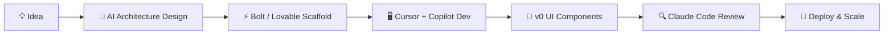

<div align="center">

<!-- Dynamic Header Banner -->


<!-- Typing SVG -->


<br/>

<!-- Social Badges -->
[](https://github.com/)

[](https://linkedin.com/)

</div>

---

## 🧬 About Me

```ts
const Ali = {
  name       : "Ali M.M",
  title      : "Full Stack & Backend Engineer",
  university : "University of Karbala — CS & IT",
  location   : "Karbala, Iraq 🇮🇶",
  focus      : ["Backend Systems", "API Design", "SaaS Architecture"],
  philosophy : "Write code that your future self will thank you for.",
  currentlyBuilding: "Scalable SaaS apps with AI-accelerated workflows",
  funFact    : "I sometimes get lost in architecture diagrams... and love it 😄",
};
```

---

## 🤖 AI-Powered Development Stack

> I use cutting-edge AI tools to **supercharge development speed**, improve code quality, and build **SaaS products faster than ever**.

<div align="center">

| Tool | Purpose | Use Case |
|------|---------|----------|
| 🤖 **Claude (Anthropic)** | AI pair programmer & architect | System design, code review, debugging |
| ⚡ **GitHub Copilot** | In-editor AI autocomplete | Real-time code suggestions & boilerplate |
| 🖥️ **Cursor IDE** | AI-native code editor | Codebase-aware AI chat & edits |
| 🎨 **v0 by Vercel** | AI UI generation | Rapid frontend prototyping & components |
| 🌊 **Bolt.new** | Full-stack AI builder | Instant full-stack SaaS scaffolding |
| 🔮 **Lovable** | AI SaaS generator | MVP building from natural language |
| 🛠️ **Windsurf (Codeium)** | AI agentic editor | Autonomous multi-file code generation |
| 📋 **ChatGPT / GPT-4** | General AI assistant | Research, docs, regex, SQL queries |
| 🔍 **Perplexity AI** | AI-powered search | Fast technical research & discovery |
| 🎯 **Tabnine** | Team-aware AI completion | Context-aware multi-language completion |

</div>

### 🏗️ How I Build SaaS with AI



---

## 🛠️ Core Technology Stack

<div align="center">

### Backend & APIs


### Frontend & Full Stack


### Databases


### DevOps & Tools


</div>

---

## 🧠 Architecture & Engineering Interests

<div align="center">

```
┌─────────────────────────────────────────────────────────────────┐
│                    Engineering Philosophy                        │
├──────────────────────┬──────────────────────────────────────────┤
│  🧱 Clean Arch       │  Layers that respect boundaries          │
│  🧭 Domain-Driven    │  Code that mirrors the real world        │
│  🏗️  N-Tier Arch     │  Clarity through separation of concerns  │
│  🎛️  Design Systems  │  Consistency & reusability at scale      │
│  🗃️  Schema Design   │  Efficient, normalized data structures   │
│  ✨ Clean Code       │  Readable, testable, maintainable        │
│  🔁 Reusable Code    │  DRY principles, composable modules      │
│  🌐 API Design       │  RESTful, versioned, future-proof        │
│  🤖 AI Integration   │  Embedding AI into backend pipelines     │
└──────────────────────┴──────────────────────────────────────────┘
```

</div>

---

## 📊 GitHub Stats

<div align="center">
  
  
</div>

<div align="center">
  
</div>

<div align="center">
  
</div>

---

## 📚 Currently Reading

<div align="center">

| 📖 Book | ✍️ Author | 📌 Topic |
|---------|-----------|---------|
| *Ultimate ASP.NET Core Web API* | Marinko Spasojevic & Vladimir Pecanac | Backend APIs |
| *C# 12 in a Nutshell* | Joseph Albahari | Language Mastery |
| *SQL Pocket Guide (4th Ed.)* | Jonathan Gennick | Database Querying |

</div>

## 🎯 Reading Queue

<div align="center">

| 📖 Book | ✍️ Author | 🔥 Priority |
|---------|-----------|------------|
| *Clean Code* | Robert C. Martin | ⭐⭐⭐⭐⭐ |
| *Clean Architecture* | Robert C. Martin | ⭐⭐⭐⭐⭐ |
| *Learning Domain-Driven Design* | Vlad Khononov | ⭐⭐⭐⭐ |
| *REST APIs with ASP.NET Core 8* | Anthony Giretti | ⭐⭐⭐⭐ |
| *Building Microservices* | Sam Newman | ⭐⭐⭐ |

</div>

---

## 🤝 Let's Connect & Build Together

<div align="center">

> 💬 **Open to collaborations** on backend systems, API architecture, SaaS MVPs, or AI-integrated applications.

[](https://github.com/)
[](https://linkedin.com/)
[](mailto:ali@example.com)


</div>
